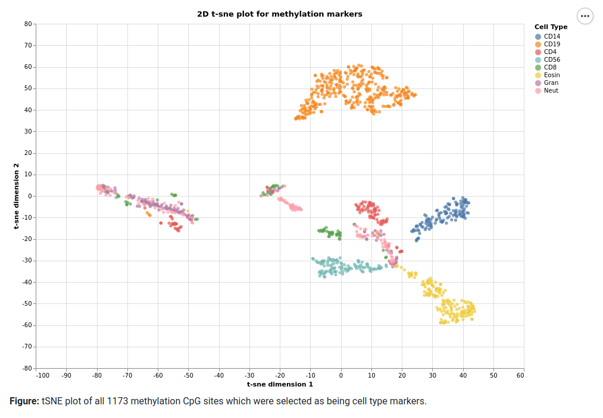

# tSNE_plotting

This plot is an interactive companion to the data that is detailed in our recent publication [DOI: <a href="https://dx.doi.org/10.21203/rs.2.13274/v1" target="blank">10.21203/rs.2.13274/v1</a>].

#### example

<blockquote><b>Citation:</b>
<i>Donia Macartney-Coxson, Alanna Cameron, Jane Clapham, and Miles C Benton. DNA methylation in bloodpotential to provide new insights in immune cell biology, 
20 August 2019, PREPRINT (Version 1) available at Research Square [DOI: <a href="https://dx.doi.org/10.212rs.2.13274/v1" target="blank">10.21203/rs.2.13274/v1</a>]</i></blockquote>